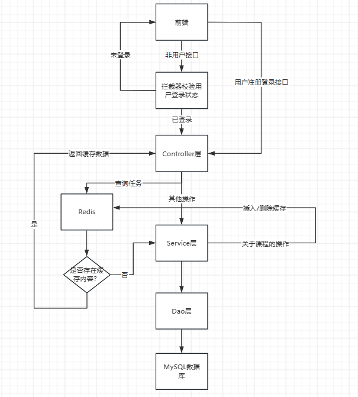
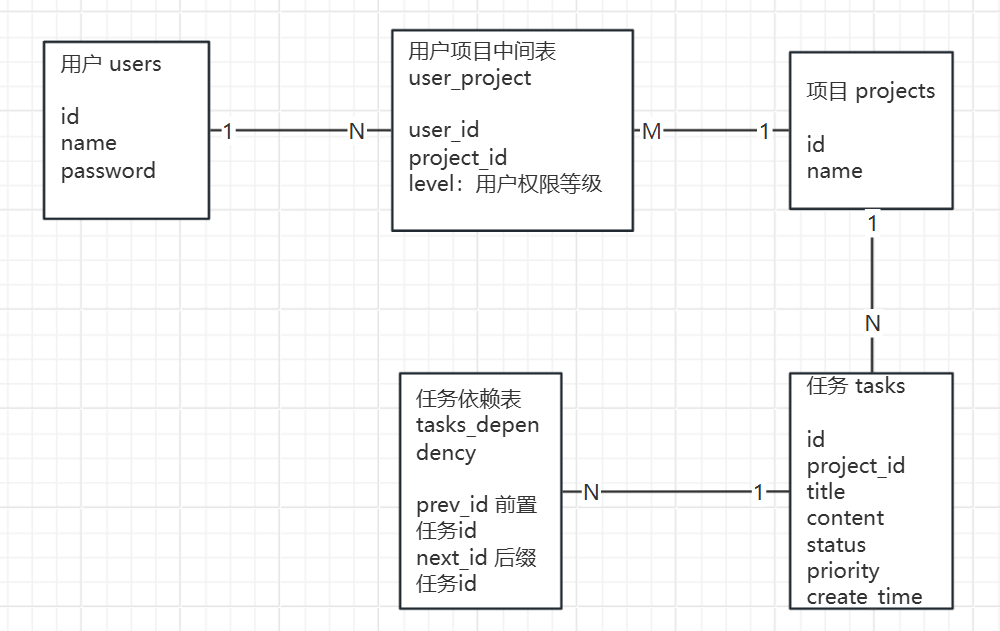

# 系统设计文档

# 一、概述

## 1.1 文档目的

本文档用于描述任务管理系统的整体技术架构、模块设计、数据结构、接口定义和部署方案，供开发、测试、运维等相关人员参考。

## 1.2 系统目标

设计并实现一个支持项目与任务管理、筛选查询的迷你任务管理系统，具备良好的可扩展性与稳定性。

# 二、系统架构设计

## 2.1 系统流程图



## 2.2 模块划分

|模块名称|功能说明|
| --------| --------------------|
|用户模块|注册、登录|
|项目模块|项目创建、查看、删除|
|任务模块|任务增删改查、筛选|
|API 层|暴露 REST 接口|
|数据库层|MySQL 数据持久化|

# 三、数据库设计

## 3.1 ER 图



## 3.2 建表语句

```sql
CREATE DATABASE mini_task_management_system;

USE mini_task_management_system;

CREATE TABLE users
(
    id       BIGINT PRIMARY KEY AUTO_INCREMENT,
    name     VARCHAR(15) NOT NULL UNIQUE,
    password VARCHAR(100) NOT NULL
);

-- 项目表
CREATE TABLE projects
(
    id   BIGINT PRIMARY KEY AUTO_INCREMENT,
    name VARCHAR(100) NOT NULL
);

-- 任务表
CREATE TABLE tasks
(
    id           BIGINT PRIMARY KEY AUTO_INCREMENT,
    project_id   BIGINT       NOT NULL,
    title        VARCHAR(100) NOT NULL,
    content      VARCHAR(1000),
    status       INT          NOT NULL DEFAULT 0,
    priority     INT          NOT NULL DEFAULT 1,
    created_time TIMESTAMP             DEFAULT CURRENT_TIMESTAMP,
    FOREIGN KEY (project_id) REFERENCES projects (id) ON DELETE CASCADE,
    -- 单字段索引
    INDEX idx_tasks_status (status),
    INDEX idx_tasks_priority (priority),
    INDEX idx_tasks_created_time (created_time)
);

-- 中间关联表：用户-项目 多对多关系
CREATE TABLE user_project
(
    user_id    BIGINT NOT NULL,
    project_id BIGINT NOT NULL,
    level      INT    NOT NULL,
    PRIMARY KEY (user_id, project_id),
    FOREIGN KEY (user_id) REFERENCES users (id),
    FOREIGN KEY (project_id) REFERENCES projects (id)
);

-- 任务依赖表
CREATE TABLE task_depen
(
    prev_id BIGINT NOT NULL,
    next_id BIGINT NOT NULL,

    FOREIGN KEY (prev_id) REFERENCES tasks (id) ON DELETE CASCADE,
    FOREIGN KEY (next_id) REFERENCES tasks (id) ON DELETE CASCADE
);
```

# 四、接口设计

## 4.1 用户模块

|功能|请求方式|URI|
| --------------------------| --------| -------------------|
|用户注册|Post|/api/users/register|
|用户登录|Post|/api/users/login|
|用户信息查看（看自己）|Get|/api/users/me|
|用户信息查看（看其他用户）|Get|/api/users/{id}|

## 4.2 项目模块

|功能|请求方式|URI|
| ----------------| --------| ------------------------------|
|创建项目|Post|/api/projects|
|修改项目|Put|/api/projects|
|删除项目|Delete|/api/projects/{projectId}|
|查看所有项目|Get|/api/projects|
|查看当前项目|Get|/api/projects/{projectId}|
|查询项目关联用户|Get|/api/projects/user/{projectId}|
|项目关联用户|Post|/api/projects/user|

## 4.3 任务模块

|功能|请求方式|URI|
| ----------------| --------| -------------------------------------------------|
|创建任务|Post|/api/tasks|
|删除任务|Delete|/api/tasks|
|修改任务内容|Put|/api/tasks|
|修改任务状态|Put|/api/tasks/status|
|查看单个任务详情|Get|/api/tasks/{taskId}|
|查看所有任务|Get|/api/tasks/projectId=1&type=1&status=0&priority=1|

## 五、关键设计说明

### 5.1 状态流转设计

任务状态有以下状态

```text
todo:0
doing:1
done:2
```

更改任务状态前需要检查前置任务的完成情况

### 5.2 安全性设计

* 使用 token 进行用户登录鉴权
* API 接口权限检查（用户只能操作自己的项目/任务）

### 5.3 返回值

* 所有 API 返回统一格式：

```json
{
  "code": 200,
  "message": "ok",
  "data": {}
}
```

# 六、环境说明

## 6.1 技术栈

|层级|技术|
| ------| --------------------------|
|前端|略|
|后端|SpringBoot3 + MyBatis Plus|
|数据库|MySQL + Redis|
|测试|Postman + 单元测试|

# 七、可扩展内容

1. 更多用户描述字段、项目描述字段、任务描述字段（如标签、截止时间）
2. 拓扑排序实现流程图
3. 手机验证码登录
4. 更细分的项目权限
